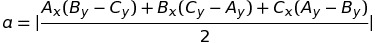
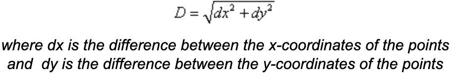

# Cartesian geometry with JavaScript <!-- omit in toc -->

Exploring the Cartesian coordinate system with JavaScript and TDD.

This is a WIP 🚧

## Table of Contents <!-- omit in toc -->
- [First steps](#first-steps)
  - [First test](#first-test)
  - [Second test](#second-test)
  - [Edge cases](#edge-cases)
  - [Calculating distance between two points](#calculating-distance-between-two-points)
- [Triangulation for our project](#triangulation-for-our-project)
  - [Comparing the sides of a triangle](#comparing-the-sides-of-a-triangle)
  - [Classification of triangles](#classification-of-triangles)
  - [Using our `makeTriangle` function in another test](#using-our-maketriangle-function-in-another-test)
- [Implementing a helper function](#implementing-a-helper-function)
  - [Tidying up](#tidying-up)
  - [Updating some tests](#updating-some-tests)
- [router](#router)

## First steps

### First test

Our first test `makes a line out of two points` will drive the development of a function that does the following: 
  - receives a couple of ordered pairs as an argument 
  - returns an object with a property `type: 'LINE'` 

### Second test

Our second test `makes a triangle from three points` drives the development of a function that does the following:
  - receives three ordered pairs as an argument 
  - returns an object with a property `type: 'TRIANGLE'` 

### Edge cases

Keeping the test data simple is beneficial for a few reasons. Just using coordinates like `[0, 0], [1, 1]` and `[0, 0], [1, 1], [2, 2]`. This makes the tests easy to reason about, and it helps me to imagine _edge cases_.

The first edge case for the `makeTriangle` function is three points that make a line. In fact, our test data satisfies this condition. The mathematical term for this is _collinear_. 
We will need to write a test for collinear points, and then implement a solution to make that test pass. How can we write code that detects if points are collinear? Mathematics gives us a formula to find the _area of a triangle_. If the area is equal to zero, then the points are collinear and do not form a triangle.



Another edge case we should account for in the `makeLine` function is two ordered pairs pointing to identical coordinates. That does not make a line.

Once we satisfy those cases with code, we need to update our `'makes a triangle from three points'` test data. We can update the test data value (`coordinates`) by copying the test data from the test for our `areaOfATriangle` function.

```javascript
test('makes a triangle from three points', () => {
    const result = makeTriangle([0, 0], [1, 1], [2, 2]);
    // ...
```

becomes this

```javascript
test('makes a triangle from three points', () => {
    const result = makeTriangle([0, 0], [2, 4], [10, 5]);
    // ...
```

Note that for tests I will assign the return value of a function I want to test to a variable `result`. This keeps test assertion statements short and readable.

We could optionally save the old data values for a _sad path_ test of that function, or another.

### Calculating distance between two points

When we're dealing with lines and triangles, an essential tool is the _Pythagorean Theorem_:

>In a right triangle, the square of the hypotenuse is equal to the sum of the squares of the other two sides.

The hypotenuse is the side opposite the right angle, and it will be the longest side of the triangle.


Before we can use Pythagoras' Theorem, we need to know the length of the sides.

To find the distance between two points, we can use this formula:



```javascript
test('calculates the distance between two points', () => {
    const result = distanceBetweenTwoPoints([15, 20], [35, 5]);

    expect(result).toBe(null);
});
```

Also note that I am asserting the value to equal `null`. This is a temporary assertion. Why? To prevent a _false positive_.

A false positive can occur if I don't pass any value to `toEqual()`. All I need to do to make a test pass in this case is to declare and export a function named `distanceBetweenTwoPoints` and ensure I've imported it to the test suite. Here's what that function looks like now:

```javascript
function distanceBetweenTwoPoints(input) {} 
```

The function does nothing, but it can make the test pass if we assert nothing or `undefined`. So we assert a `null` value and prevent a false positive. Now are test is failing, and this is good! We can be confident that we have a legitimate test.

I've decided that I don't want to get granular in testing this `distanceBetweenTwoPoints` function, so I will plug in values from a geometry text book. The distance between points in our test case is `25`, so I will swap out our `null` assertion for `25`.

I update the function signature to take two parameters `pointA` and `pointB`.

```javascript
function distanceBetweenTwoPoints(pointA, pointB) {
    const dx = pointA[0] - pointB[0];         // difference between the points' x-coordinates
    const dy = pointA[1] - pointB[1];         // difference between the points' y-coordinates
    const sumOfDiffs = (dx * dx) + (dy * dy); // add the squares of the difference values

    return Math.sqrt(sumOfDiffs);             // return the square root of the sum
}
```

The test passes! 

## Triangulation for our project

We implement the `distanceBetweenTwoPoints` function along with the _Converse of the Pythagorean Theorem_ to classify triangles. We want to determine if a triangle is right, equilateral, isosceles, scalene, acute, or obtuse.

### Comparing the sides of a triangle

Sides and angles are the criteria for classifying a triangle. We have not implement a way to test or measure angles, so we'll stick to the sides for now. We want to compare the sides of a triangle.

Our first step is to measure the sides of a triangle.

Then we compare the measurements.


### Classification of triangles

|  Triangle   |                              Description                              |
| :---------: | :-------------------------------------------------------------------: |
|    Right    |                        Features one 90° angle.                        |
| Equilateral |        All sides & angles are congruent. (All angles are 60°.)        |
|  Isosceles  |                  Two equal sides & two equal angles.                  |
|   Scalene   |        No congruent sides. (Each side has a different length.)        |
|    Acute    | Features three acute angles. (An acute angle measures less than 90°.) |
|   Obtuse    |             Features one angle measuring larger than 90°.             |

Let's create a function that receives a triangle and appends a `classification` property on the object returned from `makeFunction`.

### Using our `makeTriangle` function in another test

This is what our actual result data will look like:

```javascript
    const triangle = makeTriangle([0, 0], [2, 4], [10, 5]); // Create a triangle
    const result = classifyTriangle(triangle);              // Invoke our soon to be created `classifyTriangle` function
```

And this is what how we make our mock data or our **exptected** data:

```javascript
    const expected = { ...triangle, classification: null };  // Clone `triangle` and append a `classification` property
```

And putting it all together in a single test looks like:

```javascript
test('appends a classification property on the object returned from `makeFunction`', () => {
    const triangle = makeTriangle([0, 0], [2, 4], [10, 5]);
    const result = classifyTriangle(triangle);
    const expected = { ...triangle, classification: null };

    expect(result).toEqual(expected);
});
```

Our function that makes this test pass:

```javascript
function classifyTriangle(obj) {
    obj["classification"] = null;
    return obj;
}
```

>💡Don't forget to export and import the function appropiately!

Note that the `classification` property is pointing to a `null` value. We want to expand on this new function so that it dynamically classifies triangles based on their characteristics. We need tests cases to drive development of classifications of different kinds of triangles. 

We will use a `describe` test block to group the classification tests together.

```javascript
describe('Triangle classification', () => {
  // The test for `classifyTriangle` and other related tests will be placed inside here.
  // ...
}
```

Referring back to our [Classification of triangles](#classification-of-triangles) table, we will make constant variables assigned to each of the types of triangles.

```shell
$ mkdir constants
$ touch constants/triangleTypes.js
```

Add this to `constants/triangleTypes.js`:

```javascript
const RIGHT = 'RIGHT';
const EQUILATERAL = 'EQUILATERAL';
const ISOSCELES = 'ISOSCELES';
const SCALENE = 'SCALENE';
const ACUTE = 'ACUTE';
const OBTUSE = 'OBTUSE';

module.exports = {
    RIGHT, EQUILATERAL, ISOSCELES, SCALENE, ACUTE, OBTUSE
};
```

Finally, add this line at or near the top of both your source code and test file:

```javascript
const triangleTypes = require('./constants/triangleTypes');
// ... 
```

Now we can use the constants like this `triangleTypes.ACUTE` and with that we get some a few benefits such as: 
- No errors from mispelling a string (e.g., `'ISOCELES'` and `'EQIULATERAL'`).
- Utilizing features from our favorite text editor or IDE where we can start typing `triangeTypes.` then have a list of constants pop up to select from, and hit the `tab` key for autocomplete.
- By importing constants into our source code and test file, we get consistency.

Back to our `describe` test which will contain the block of tests pertaining to the classification of triangles, I've decided that I want to put a pause on writing these tests. For now we will _skip_ these tests and direct out focus elsewhere.

Your test framework should have a simple mechanism for skipping tests. I am using Jest, and Jest skips tests by prefixing an `x` to a test like `xtest` or `xdescribe`. I will prefix an `x` to the first line of my tests for triangle classification like this:

```javascript
xdescribe('Triangle classification', () => {
  // ...
```

And now any tests nested inside this test will also be skipped.

## Implementing a helper function 

At some point we will need to validate the number of arguments passed to our functions. A line expects two ordered pairs, and a triangle expects three ordered pairs. There are a few ways we could go about this. For example, validation could be handled by a client application or it could be handled on the server. Since this is a Node.js application (at least for the time being) we will keep the validation server-side. However, if we turn this into a full-stack web application with then we could implement validation on the client via HTML forms at the time an HTML `submit` button is clicked. If we're using a UI library like React.js, then it is relatively easy to handle validation in real-time as it is being input by a user.

Remembering that we decided to handle validation server-side, we have more options still. Each function could handle validation on it's own, or we could make a pipeline that receives any and all data, wraps it into an array, and routes and passes it to the appropiate function based on the number of ordered pairs contained in the array. We will choose the former.

We will test that a helper function `'wraps arguments in single array'`. This helper function is generic and doesn't do anything specific in regards to geometry, but we can still scope it to a context that will make it distinct from the rest of the code. That context will be called `utility`–even though we've been talking about a _helper_ function, utitilty is a word that we can also use to describe this context. Let's create both a source code file and a test file for it. 

```shell
$ touch utility.js utility.test.js
```

We want our test to check the length of the `Array` returned by the new utility function:

```javascript
test('wraps arguments in single array', () => {
    const result = wrapArgsInSingleArray(1, 2);

    expect(result.length).toBe(2);
});
```

I can make the test pass by implementing the following code:

```javascript
function wrapArgsInSingleArray(...args) {
    let argsInSingleArray = [];
    for (let i = 0; i < args.length; i++) {
        argsInSingleArray.push(args[i]);
    }

    return argsInSingleArray;
}
```

This code works because the _rest parameter_ syntax `...args` represents an indefinite number of arguments in a single `Array` instance.

### Tidying up

Now we need to do some tidying up. Running the `ls` command shows all our of files, and you may imagine how cluttered our project directory could become if don't get a handle on it now.

I'm going to create a folder for all of the source code. There is no standard convention, but popular names for JavaScript source code folders include `app`, `lib`, or `src`. I'm going with the final option.

```shell
$ mkdir src
```

Now we move all our `.js` files into our new `src` folder, **however** we don't want to include any `.test.js` files. RegEx (_regular expressions_) are a powerful for computer programming. There are awesome tools such as [regex101](https://regex101.com/), but if I'm already a bit confident in a RegEx pattern I will test it with a `read only` command like `ls` before I do any `write` or delete actions like `mv` or `rm`.

```shell
$ ls *[^test].js
```

The RegEx pattern above matches on all files ending in `.js` _excluding_ `*.test.js` files. Running `ls` confirms this by listing only the appropiate files. Now that we are confident with our RegEx pattern, we can use it to move files into the new `src/`.

```shell
$ mv *[^test].js src/
```

Finally, we need to put our test files somewhere. Let's create a `test/` folder.

```shell
$ mkdir test
```

Now we move the test files into `test/`.

```shell
$ mv *.test.js test/
```

We cannot run our tests now because of these changes. Try to run the test and you will see this output in terminal:

```shell
FAIL test/utility.test.js
  ● Test suite failed to run

  Cannot find module './utility' from 'utility.test.js'
```

This is a simple fix: we just need to update the paths. For example, at the top of `utility.test.js`, `require('./utility');` should be updated to `require('../src/utility');`. Update all the out of date paths until the test suite runs.

### Updating some tests

Some of our tests expect an object literal `{}` to be returned with a `type` property. We want to update that expectation so a second property `coordinates` is also included in that object literal. To get you started, we will update the `'makes a line out of two points'` test so that the line:

```javascript
    expect(makeLine([0, 0], [1, 1])).toEqual({ type: 'LINE' });
```

is updated to:

```javascript
    expect(makeLine([0, 0], [1, 1])).toEqual({ type: 'LINE', coordinates: [[0, 0], [1, 1]] });
```

All we are doing is telling the computer we expect the coordinates property to point to a single `Array` that contains the given coordinates. Update the remainder of tests appropiately.

## router

As mentioned in [implementing a helper function](#implementing-a-helper-function), we are going to build a pipeline that receives input, transforms it into one data structure, and routes it to an appropiate function. Let's create new files and get started.

```shell
$ touch src/router.js test/router.test.js
```

